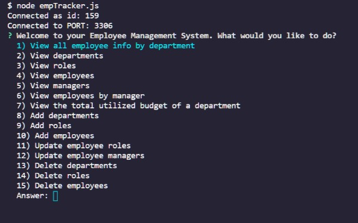
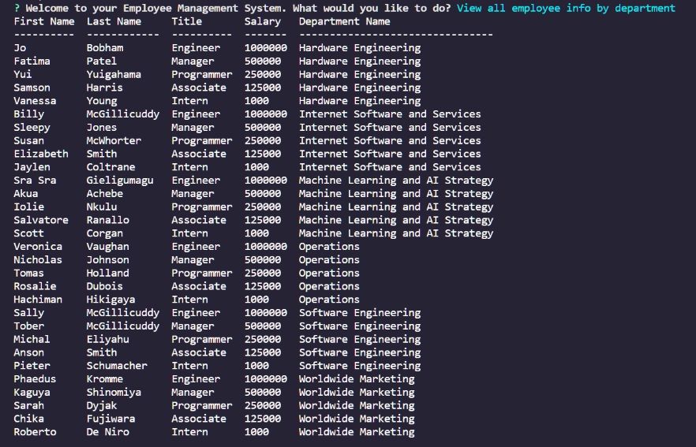

# Employee-Tracker 
[](https://github.com/jdavidrice/Employee-Tracker/blob/master/LICENSE)
[](https://app.codacy.com/gh/jdavidrice/Employee-Tracker?utm_source=github.com&utm_medium=referral&utm_content=jdavidrice/Employee-Tracker&utm_campaign=Badge_Grade)
## Description 

Developers are often tasked with creating interfaces that make it easy for non-developers to view and interact with information stored in databases. Often these interfaces are known as **C**ontent **M**anagement **S**ystems. This "Employee-Tracker" app represents a solution for managing a company's employees using node, inquirer, and MySQL.




[Walkthrough Video](https://drive.google.com/file/d/1v0JBJbUx7DrIV2niXRns7s90kMrnPdbF/view)

## Table of Contents

*   [Description](#Description)
*   [Installation](#Installation)
*   [Usage](#Usage)
*   [Questions](#Questions)
*   [License](#License)
*   [Contributing](#Contributing)
*   [Tests](#Tests)

## Installation
 
1.  Fork this repository and download it to your computer.
2.  Install [Node.js](https://nodejs.org/en/download/) for your operating system. 
3.  Install and configure [MySQL](https://www.mysql.com/downloads/) for your operating system.
4.  Install the Node Project Manager [NPM](https://docs.npmjs.com/downloading-and-installing-node-js-and-npm).
5.  Additional dependencies for this app will be installed when you install NPM.

*   [Return to Top](#Employee-Tracker)

## Usage 

1.  Use the following command to start the app:
```
$ node empTracker.js
```
2.  Answer the question prompts to observe how you can view and manipulate a sample set of employee data. 

*   [Return to Top](#Employee-Tracker)

## Questions

Please contact me at the email address listed below with any questions about this app. 

[jdavidrice@gmail.com](mailto:jdavidrice@gmail.com)

[Repository Owner GitHub Profile](https://github.com/jdavidrice)

*   [Return to Top](#Employee-Tracker)

## License

MIT License

Copyright (c) 2021 Jeremy Rice

Permission is hereby granted, free of charge, to any person obtaining a copy
of this software and associated documentation files (the "Software"), to deal
in the Software without restriction, including without limitation the rights
to use, copy, modify, merge, publish, distribute, sublicense, and/or sell
copies of the Software, and to permit persons to whom the Software is
furnished to do so, subject to the following conditions:

The above copyright notice and this permission notice shall be included in all
copies or substantial portions of the Software.

THE SOFTWARE IS PROVIDED "AS IS", WITHOUT WARRANTY OF ANY KIND, EXPRESS OR
IMPLIED, INCLUDING BUT NOT LIMITED TO THE WARRANTIES OF MERCHANTABILITY,
FITNESS FOR A PARTICULAR PURPOSE AND NONINFRINGEMENT. IN NO EVENT SHALL THE
AUTHORS OR COPYRIGHT HOLDERS BE LIABLE FOR ANY CLAIM, DAMAGES OR OTHER
LIABILITY, WHETHER IN AN ACTION OF CONTRACT, TORT OR OTHERWISE, ARISING FROM,
OUT OF OR IN CONNECTION WITH THE SOFTWARE OR THE USE OR OTHER DEALINGS IN THE
SOFTWARE.

*   [Return to Top](#Employee-Tracker)

## Contributing

  Jeremy Rice

*   [Return to Top](#Employee-Tracker)

## Tests

No tests

*   [Return to Top](#Employee-Tracker)
